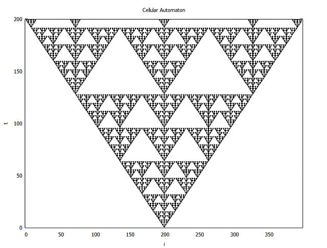

Cellular Automaton
==================
````
gnuplot> set palette defined ( 0 "white", 1 "black" )
gnuplot> set autoscale xfix
gnuplot> set autoscale yfix
gnuplot> set xlabel 'i'
gnuplot> set ylabel 't'
gnuplot> set title "Cellular Automaton"
gnuplot> plot 'automaton.dat' matrix with image

````

<p align="center">
  
</p>
