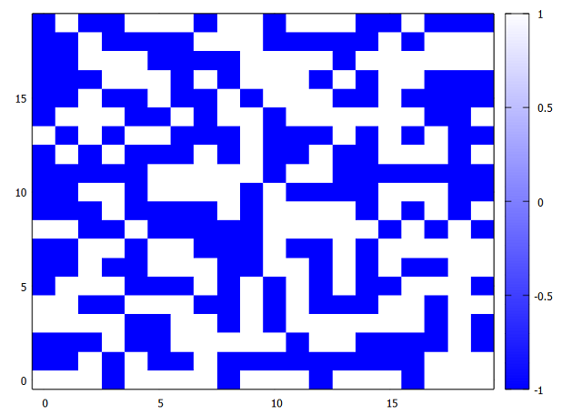

Connected Components and Percolation
====================================
Here we discuss about the connected components over a square lattice and percolation.

## Connected components
This program [connected_components.c](connected_components.c) finds the connected components in a 2-dimensional square lattice. L is the number of nodes per row and per column so that the total (volume) number is LxL. Each node of the lattice
has a label and a state, kept in two separate 2D arrays. At the
beginning each node is initialized with a unique label and then
its state is randomly set to spin down (-1) or spin up (+1).
The number of nodes that may take the state spin down is set through
the density. After the initialization is completed, the program
finds the connected component, that is the nodes that have the
same state and are nearest neighbors. Each node state is compared
to its nearest neighbors' and if they are in the same state (spin
up or down) the label of the node that is lexically lower is copied
to the node with the higher label so that they both have the same
(lower) label. The program loops several times through all the nodes
in the lattice till there are labels that are changed and when there
are no changes it prints the lattice with the state and the final
label of each node that can be used to identify the connected
components. There is a maximum number of loops in case the algorithm
cannot find all the connected components.
The output data can be ploted using gnuplot with the commands

````
gnuplot> set palette defined ( -1 "blue", 1 "white" )
gnuplot> set autoscale xfix
gnuplot> set autoscale yfix
gnuplot> plot 'output_cc.dat' matrix with image
````
<p align="center">
  
</p>

## Percolation
The percolation threshold $p_c$ is the ratio of the number of open sites to the total number of sites of a lattice for which there exists a path of open sites from the top to the bottom row or from the 1st columns to the last one. Another way of saying the same thing is that there exists an extensive cluster in the lattice, a connected component that has at least one site on the top row (1st column) of the lattice and at least one site on the bottom row (last column). In this model we do not assume any exchange between sites that can modify their state so it does not change once it has been set at the beginning of a simulation. The percolation threshold is studied in physical systems that are composed of a large number of atoms and molecules, usually an Avogadro's number $N_A$ of particles where $N_A = 6.022𝖷10^23$.
